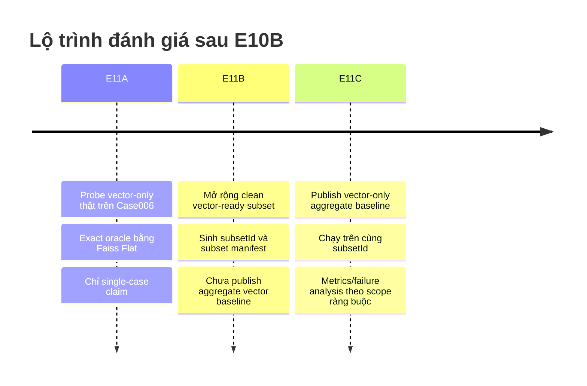
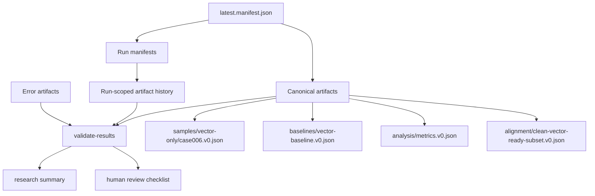

# Báo cáo thẩm định và tăng cường lộ trình E11A E11B E11C cho pipeline evaluation research

## Tóm tắt điều hành

Hoàn tất E10B là một cột mốc hạ tầng quan trọng, nhưng về mặt phương pháp luận đánh giá, nó **chưa** tương đương với việc đã có một benchmark retrieval mạnh. Theo mô hình Cranfield và truyền thống TREC, giá trị của đánh giá IR đến từ **test collection chung, quy trình chấm điểm thống nhất, và tuyên bố kết quả bị ràng buộc bởi scope đo lường**; không phải từ một ví dụ đẹp đơn lẻ. NIST mô tả Cranfield như khuôn mẫu để so sánh tương đối các phương pháp retrieval trên test collections, còn TREC nhấn mạnh large test collection, uniform scoring procedures, và thậm chí cấm advertising claims dựa trên kết quả TREC. Đồng thời, BEIR cho thấy BM25 vẫn là một baseline rất robust trên thiết lập zero-shot đa miền; dense retrieval có thể hiệu quả hơn về tính toán nhưng thường không ổn định khi ra khỏi điều kiện hẹp. Điều đó xác nhận hướng chia E11 thành ba nấc là hợp lý: **E11A để xác thực đường vector-only thật trên một clean case; E11B để mở rộng clean subset và định nghĩa scope công bằng; E11C mới là nơi xuất bản aggregate vector-only baseline trên cùng subset**. citeturn10view0turn21view1turn27view2turn20view0

Khuyến nghị cốt lõi của báo cáo này là: **không** dùng `baselines/vector-baseline.v0.json` ngay ở E11A; thay vào đó, E11A nên sinh artifact single-case dưới `samples/vector-only/`. E11B cần formalize một `subsetId` sạch, machine-verifiable, và dùng chính subset đó làm scope bắt buộc cho E11C. Chỉ tại E11C mới nên xuất bản `vector-baseline.v0.json`, và mọi claim lúc đó phải gắn chặt với `datasetVersion`, `subsetId`, `caseIds`, `caseCount`, và `knownLimits`. Cách chia pha này vừa phù hợp với logic TREC/Cranfield về common collection, vừa phản ánh bài học của BEIR rằng benchmark đáng tin phải có **đa dạng và scope rõ ràng** thay vì suy rộng từ một case. citeturn10view0turn10view1turn20view0

Về kỹ thuật pipeline, tôi khuyến nghị tăng thêm một lớp rigor so với E10B: giữ **canonical stable artifacts** làm “latest successful truth”, nhưng đồng thời bổ sung **run-scoped immutable artifacts** và **run-scoped manifests** để có provenance trọn vòng đời. W3C PROV định nghĩa provenance là thông tin về entities, activities, agents tạo ra dữ liệu; PROV-DM còn có khái niệm bundle để biểu diễn provenance của provenance. FAIR cũng nhấn mạnh machine-actionable metadata. Suy ra trong pipeline này, `latest.manifest.json` nên đóng vai trò “dashboard/pointer”, còn `runs/<runId>/manifest.json` mới là hồ sơ bất biến của từng lần chạy. Điều này đặc biệt quan trọng cho DB-down, stale artifact, và audit sau này. citeturn10view4turn10view5turn9search11

Báo cáo cũng khuyến nghị tiêu chuẩn hóa ba nhóm kiểm định tự động: **provenance invariants**, **scope invariants**, và **artifact integrity invariants**. Đối với alias equality, nên dùng JSON canonicalization theo RFC 8785 để so sánh semantic equality một cách xác định; đối với vector-only, nên kiểm định profile query/document tương thích theo task type của nhà cung cấp embeddings và model consistency; đối với approximate retrieval, E11A nên có một exact oracle bằng Faiss `Flat` để xác nhận ANN/vector DB không “ảo thuật” kết quả trên clean case. Faiss nêu rõ `Flat` là exact baseline và khi chỉ có ít truy vấn thì direct computation thường là lựa chọn hiệu quả hơn xây ANN; Google yêu cầu retrieval dùng phân vai query/document task types; Elastic khẳng định query vectors và indexed vectors phải đến từ cùng model thì similarity mới có nghĩa. citeturn25search2turn18view0turn18view1turn15view0turn19view1

Cuối cùng, hệ thống đánh giá cục bộ trong repo vẫn nên là **system of record**. OpenAI mô tả eval-driven development, continuous evaluation, và human calibration là trọng tâm, nhưng nền tảng Evals của OpenAI hiện đã có lộ trình read-only rồi shutdown vào cuối năm 2026; Anthropic cũng nhấn mạnh success criteria phải task-specific, measurable, có edge cases, và grading nên được calibrate. Do đó, vendor tools nên được xem là nguồn tham chiếu hoặc phụ trợ, không thay thế local manifest, local validators, local artifacts. Với hướng này, E11A/B/C có thể được chuẩn hóa thành một lộ trình nghiên cứu vững hơn, ít “benchmark theatre” hơn, và có khả năng audit tốt hơn. citeturn10view6turn13view1turn12view0turn12view1

## Cơ sở phương pháp luận cho lộ trình sau E10B

Trong IR evaluation, Cranfield và TREC vẫn là hai neo phương pháp luận quan trọng nhất cho bài toán của bạn. NIST mô tả test collection paradigm là phương pháp chi phối trong IR và giải thích rằng nó tăng “power” của thí nghiệm so với user-based evaluation bằng cách kiểm soát nhiều nguồn biến thiên. TREC tiếp tục tinh thần này bằng bộ sưu tập lớn, uniform scoring procedures, và diễn đàn so sánh công bằng giữa các hệ thống. Điều này dẫn đến một nguyên tắc đơn giản nhưng rất quan trọng cho E11: **nếu chưa có scope chung đủ sạch, chưa được phép đưa ra claim so sánh aggregate**. citeturn10view0turn10view1turn27view2

BEIR bổ sung một bài học rất thực tế cho roadmap. Trong benchmark zero-shot dị thể, BM25 vẫn là baseline robust; reranking và late interaction thường đạt kết quả mạnh hơn trung bình, còn dense/sparse retrieval tuy hiệu quả tính toán hơn nhưng thường underperform trong nhiều bối cảnh. Hệ quả là nếu bạn nhảy ngay từ “Case006 vector path works” sang “vector-only baseline aggregate tốt” thì sẽ đi ngược tinh thần benchmark hiện đại: một methodology vững cần chứng minh **both plumbing and scope fairness**. Vì vậy, E11A/B/C không chỉ là chia nhỏ công việc; nó là cách tách bạch ba câu hỏi khoa học khác nhau: “đường vector-only có thật không”, “ta có subset công bằng chưa”, và “trên subset đó vector-only đo được gì”. citeturn20view0

Đối với hệ thống tạo báo cáo có evidence, bài học từ LLM eval hiện đại cũng rất phù hợp. OpenAI nhấn mạnh rằng generative AI là biến thiên, nên exact software-style testing là không đủ; evals phải task-specific, phản ánh phân bố thực, có human judgment kết hợp với metrics, và phải continuous. Anthropic dùng ngôn ngữ gần như tương tự: success criteria phải specific, measurable, relevant; evals phải mirror real-world task distribution; grading nên ưu tiên code-based nếu được, sau đó mới human hoặc LLM-based grading; và LLM grading chỉ nên scale sau khi đã được kiểm định độ tin cậy. Đối với pipeline của bạn, điều đó có nghĩa là validator không nên đòi hỏi các dấu hiệu “đúng” theo kiểu quá brittle ở nơi không cần thiết, nhưng lại phải rất chặt về provenance, scope, và guardrails. citeturn10view6turn11view3turn11view4turn11view5turn12view0

Riêng về evaluation các hệ thống retrieval-augmented/report-augmented, TREC 2026 còn đưa ra hai gợi ý rất sát bài toán. Thứ nhất, AutoJudge track nhấn mạnh tự động đánh giá chỉ đáng tin khi được so với official manual assessments và failure modes được phân tích. Thứ hai, RAGTIME track đi thẳng vào report generation với **citation-based evaluation**, tức người chấm cần bằng chứng hỗ trợ cho claim. Điều này củng cố việc artifact sample trong E11A và aggregate báo cáo trong E11C không nên chỉ lưu rank/score, mà phải lưu **evidence support** đủ để người review kiểm tra. citeturn27view0

Về reproducibility, FAIR và PROV cho ta bộ khái niệm rõ ràng để nâng E11 lên mức “audit-ready”. FAIR đặt trọng tâm vào machine-actionable metadata; PROV-DM xem provenance như quan hệ giữa entities, activities, và agents, đồng thời hỗ trợ bundle cho provenance of provenance. Khi ghép với RFC 8785 về JSON canonicalization và ReproZip về experiment packing, ta có một khung khá đầy đủ: artifacts phải có metadata máy đọc được; mỗi run phải có identity riêng; các file JSON phải so sánh được một cách xác định; và release-grade runs nên có khả năng được đóng gói để lặp lại độc lập. Đây là nền để đề xuất immutable run history, content hashing, semantic-equality checks, và optional reproducibility bundle cho các mốc E11C hoặc release candidates. citeturn10view4turn10view5turn25search2turn23view0

## Thiết kế lại mục tiêu và claim cho E11A E11B E11C

### Mục tiêu pha và claim được phép

Bảng dưới đây là cách tôi khuyến nghị “đóng khung khoa học” cho ba pha sau E10B.

| Pha | Câu hỏi khoa học chính | Output chính | Claim được phép | Claim không được phép |
|---|---|---|---|---|
| E11A | Đường vector-only có chạy thật trên 1 clean case không? | Single-case sample + exact-oracle check | “Vector-only retrieval path hoạt động thật trên Case006.” | “Vector-only tốt hơn BM25/hybrid nói chung.” |
| E11B | Dataset v0 hiện có clean subset đủ công bằng để so sánh chưa? | Subset definition + refreshed alignment | “Đã xác định được clean vector-ready subset X/Y cases.” | “Vector-only aggregate đã được benchmark.” |
| E11C | Vector-only đo được gì trên cùng clean subset với các baseline khác? | Aggregate vector baseline + metrics/failure analysis | “Vector-only được đo trên subset S với scoring thống nhất.” | “Kết quả đại diện cho toàn bộ dataset nếu subset ≠ full dataset.” |

Lý do chia như vậy đi thẳng từ TREC/Cranfield và BEIR. TREC yêu cầu common collection và uniform scoring; BEIR nhắc rằng kết quả retrieval rất nhạy với miền và benchmark scope. Vì vậy, **single-case probe** và **aggregate benchmark** là hai loại bằng chứng hoàn toàn khác nhau, không nên đặt chung một artifact name hay một loại claim. citeturn27view2turn20view0

### E11A như một real vector-only probe

E11A nên được xem là **path validation**, không phải baseline publication. Với một clean case duy nhất, bạn đang chứng minh năm điều: dùng embedding thật; dùng query/doc profile đúng; vector search thật có trả kết quả; evidence chunks có tồn tại; và provenance đủ để audit. Faiss cho biết trong trường hợp chỉ có ít truy vấn, direct exhaustive search với `Flat` là lựa chọn hiệu quả và exact; Google yêu cầu retrieval dùng task types phân vai query/document; Elastic yêu cầu query vectors và indexed vectors cùng model thì similarity mới có nghĩa. Từ ba nguồn này, khuyến nghị mạnh là E11A luôn nên chạy thêm exact-oracle đối chiếu, thay vì chỉ tin vector DB/ANN engine. citeturn18view0turn15view0turn19view1

Khuyến nghị artifact cho E11A là:

| Loại | Path canonical khuyến nghị | Ghi chú |
|---|---|---|
| Sample JSON | `evaluation/results/v0/samples/vector-only/case006.v0.json` | Không dùng `baselines/` |
| Sample Markdown | `evaluation/results/v0/samples/vector-only/case006.v0.md` | Human-readable review sheet |
| Exact oracle JSON | `evaluation/results/v0/analysis/vector-only.case006.exact-flat-check.v0.json` | Oracle chéo bằng Faiss Flat |
| Run-scoped mirror | `evaluation/results/v0/runs/<runId>/samples/vector-only/case006.v0.json` | Immutable history |

Tên gọi “sample” thay vì “baseline” là quyết định quan trọng nhất ở E11A. Nó buộc documentation và validators phải cùng hiểu rằng đây chỉ là single-case evidence. Điều này cũng phù hợp với tinh thần TREC rằng dissemination là được, nhưng advertising claims dựa trên kết quả benchmark là không được. citeturn27view2

Pseudocode validator cốt lõi cho E11A nên giống như sau:

```ts
assert(sample.mode === "VECTOR_ONLY_CASE_PROBE");
assert(sample.caseId === "Case006");
assert(sample.alignmentVerified === true);
assert(sample.groundTruthCoverage.status === "OK");

assert(sample.provenance.embedding.provider !== "fake");
assert(!/fake|hash|random/i.test(sample.provenance.embedding.model));
assert(sample.provenance.embedding.queryProfile.model === sample.provenance.embedding.documentProfile.model);

assert(sample.provenance.embedding.queryProfile.taskType in [
  "RETRIEVAL_QUERY",
  "CODE_RETRIEVAL_QUERY",
  "unspecified"
]);
assert(sample.provenance.embedding.documentProfile.taskType === "RETRIEVAL_DOCUMENT" || sample.provenance.embedding.documentProfile.taskType === "unspecified");

assert(sample.results.length > 0);
assert(sample.results.some(r => r.isGroundTruth === true || r.artifactFilePath === sample.expectedGroundTruthFile));

if (sample.provenance.index.engineClass === "approximate") {
  assert(sample.oracleCheck.exactEngine === "faiss-flat");
  assert(sample.oracleCheck.topKOverlap >= sample.oracleCheck.minExpectedOverlap);
}
```

Điểm cần nhấn mạnh là **không nên** hard-code invariant kiểu “rank 1 phải là file X” cho vector-only ở E11A. Quy tắc đó phù hợp cho một benchmark sample đã được xác nhận trước như current-hybrid Case006, nhưng không phù hợp khi mục tiêu của E11A là kiểm plumbing và provenance, không phải ép method mới đạt kết quả “đẹp”. Phần nên hard-check là tính thật của đường retrieval, profile alignment, và exact-oracle consistency. Cách này phù hợp hơn với OpenAI/Anthropic khi họ nhấn mạnh eval phải task-specific thay vì generic, và phải tránh vibe-based evaluation. citeturn11view3turn12view0

### E11B như một subset-readiness phase

E11B nên được định nghĩa là pha **subset qualification**, không phải pha metric publication. Nhiệm vụ của nó là nâng số case trong dataset v0 đạt `cleanRetrievalEligible = true`, `scannerCoverageStatus = OK`, và `vector-ready` đủ để tạo một comparison scope công bằng. OpenAI khuyến nghị dataset evaluation là một không gian động, cần mở rộng theo thời gian khi phát hiện blind spots hoặc edge cases; Anthropic khuyến nghị evals phải phản ánh real-world distribution và edge cases. Từ đó, E11B nên sinh ra một artifact subset riêng, chứ không dùng ngầm kết quả alignment chung. citeturn13view1turn12view0

Artifact khuyến nghị cho E11B:

| Loại | Path canonical khuyến nghị | Ghi chú |
|---|---|---|
| Subset JSON | `evaluation/results/v0/alignment/clean-vector-ready-subset.v0.json` | Machine-readable scope |
| Subset Markdown | `evaluation/results/v0/alignment/clean-vector-ready-subset.v0.md` | Human review |
| Manifest pointer | `evaluation/results/v0/manifests/latest.manifest.json` | Trỏ `subsetId`, counts |
| Run-scoped manifest | `evaluation/results/v0/runs/<runId>/manifest.json` | Immutable |

`clean-vector-ready-subset.v0.json` nên chứa ít nhất `subsetId`, `datasetVersion`, `caseIds`, `caseCount`, `selectionRule`, `exclusionReasons`, `embeddingProfileConstraints`, và `snapshotConstraints`. Văn liệu nguồn không đưa ra một ngưỡng tối thiểu cứng nào cho “bao nhiêu case là đủ”; điều đó **unspecified**. TREC/Cranfield nhấn vào common collection và BEIR nhấn vào heterogeneity, nhưng không nói “5 case” hay “10 case” là con số chuẩn. Vì vậy, tôi đề xuất một heuristic thực dụng, không phải chuẩn chính thức: **ít nhất 5 clean cases hoặc ít nhất 2 distinct repositories/projects nếu dataset cho phép**, đồng thời phải có documentation rõ rằng đây vẫn là subset, không phải full dataset. citeturn10view0turn20view0

Validator cốt lõi cho E11B:

```ts
assert(subset.datasetVersion === manifest.datasetVersion);
assert(subset.caseCount === subset.caseIds.length);
assert(new Set(subset.caseIds).size === subset.caseIds.length);

for (const caseId of subset.caseIds) {
  const a = alignment.cases.find(c => c.caseId === caseId);
  assert(a.cleanRetrievalEligible === true);
  assert(a.scannerCoverageStatus === "OK");
  assert(["ALIGNED_VECTOR_READY", "VECTOR_READY"].includes(a.status));
  assert(a.missingIndexedGroundTruthFiles.length === 0);
}

assert(manifest.scopes.cleanVectorReadyV0.subsetId === subset.subsetId);
assert(manifest.scopes.cleanVectorReadyV0.caseCount === subset.caseCount);
assert(deepEqualSort(manifest.scopes.cleanVectorReadyV0.caseIds, subset.caseIds));
```

Ở E11B, claim cho phép nên rất hẹp: “v0 hiện có subset S gồm N cases đủ điều kiện clean/vector-ready để làm comparison scope”. Bạn **không** nên nói “vector-only benchmark ready cho toàn bộ dataset” trừ khi subset bằng full dataset. Điều này là hệ quả trực tiếp từ nguyên tắc common collection của TREC và bài học heterogeneity của BEIR. citeturn27view2turn20view0

### E11C như một aggregate vector-only baseline có scope ràng buộc

Chỉ đến E11C mới nên sinh artifact:

`evaluation/results/v0/baselines/vector-baseline.v0.json`

và optional legacy alias:

`evaluation/results/vector-baseline.v0.json`

Tại đây, “baseline” mới là tên gọi hợp lệ, vì bạn đã có subset rõ ràng và scoring thống nhất. TREC định nghĩa benchmark theo shared collection và uniform scoring; Anthropic và OpenAI đều nhấn mạnh success criteria và metrics phải rõ; OpenAI còn nhấn mạnh phải continuous evaluation sau mỗi thay đổi. Do đó, E11C nên đo vector-only trên **chính subsetId của E11B**, và nếu keyword/BM25/current-hybrid được so sánh, chúng phải được chạy lại hoặc at least materialized trên chính subset đó, không dùng aggregate cũ toàn dataset rồi trộn scope. citeturn27view2turn12view0turn11view3

Pipeline logic khuyến nghị cho E11C là:

```bash
pnpm eval:validate-cases \
  && pnpm eval:probe-db \
  && pnpm eval:align \
  && pnpm eval:subset:clean-vector-ready \
  && pnpm eval:baseline:keyword:subset \
  && pnpm eval:baseline:bm25:subset \
  && pnpm eval:baseline:vector \
  && pnpm eval:metrics \
  && pnpm eval:failures \
  && pnpm eval:summary \
  && pnpm eval:validate-results
```

Nếu current-hybrid aggregate trên cùng subset **chưa có**, claim ở E11C phải dừng ở mức “vector-only aggregate baseline trên subset S”. So sánh vector-only với hybrid aggregate nên để một pha kế tiếp, trừ khi bạn thực sự materialize hybrid trên cùng subset trong cùng pipeline. Bằng không, bạn sẽ vi phạm kỷ luật scope mà chính E10B đã xây nền để bảo vệ. citeturn27view2turn11view3

Mermaid timeline khuyến nghị:



## Quy ước artifact, manifest, alias và provenance

### Quy ước đặt tên artifact

Quy ước tên artifact nên phản ánh **mức bằng chứng**. Đây là bảng khuyến nghị:

| Mức bằng chứng | Prefix thư mục | Ví dụ path | Ý nghĩa |
|---|---|---|---|
| Single-case probe | `samples/` | `evaluation/results/v0/samples/vector-only/case006.v0.json` | Kiểm đường chạy và evidence |
| Aggregate baseline | `baselines/` | `evaluation/results/v0/baselines/vector-baseline.v0.json` | Kết quả gộp theo scope |
| Subset definition | `alignment/` | `evaluation/results/v0/alignment/clean-vector-ready-subset.v0.json` | Scope so sánh machine-readable |
| Analysis | `analysis/` | `evaluation/results/v0/analysis/metrics.v0.json` | Tính metric/failure từ artifacts |
| Run history | `runs/<runId>/` | `evaluation/results/v0/runs/2026-06-19T14-12-00Z/...` | Immutable provenance |
| Error-only | `errors/` | `evaluation/results/v0/errors/db-snapshot-readiness.2026-06-19T14-12-00Z.error.json` | Không ghi đè success artifact |

Cách đặt tên này là suy diễn thiết kế từ FAIR/PROV và từ chính logic benchmark của TREC/BEIR: tên artifact phải encode scope, class bằng chứng, và khả năng audit. Nó cũng giúp tránh lỗi semantic thường gặp: đặt tên “baseline” cho một file thực ra chỉ là sample. citeturn10view4turn10view5turn27view2turn20view0

### Canonical và legacy alias

Chính sách canonical/legacy nên được giữ, nhưng nên làm rõ hơn nữa ở E11:

| Rule | Khuyến nghị |
|---|---|
| Source of truth | Canonical path dưới `evaluation/results/v0/...` |
| Legacy alias | Chỉ là compatibility flat path, không được đọc nếu canonical tồn tại |
| Write path | Mọi script chỉ gọi shared helper |
| Human editing | Cấm chỉnh tay legacy alias |
| DB-down run | Không overwrite canonical success; ghi canonical error artifact riêng và update manifest/run history |
| Removal | Legacy aliases chỉ nên tồn tại hết E11/E12, sau đó xóa theo migration plan |

Lý do của rule này là provenance và machine-actionability. FAIR yêu cầu metadata máy đọc được; PROV yêu cầu ta biết entity nào do activity nào sinh ra; nếu một file alias có thể bị đọc/ghi tùy tiện, provenance chain bị đứt. Việc giữ canonical làm nguồn chân lý, còn alias chỉ là compatibility projection, là thiết kế hợp lý nhất cho một pipeline vừa nghiên cứu vừa phải hỗ trợ migration. citeturn10view4turn10view5

### Write helpers nên có gì

Tôi khuyến nghị bộ helper tối thiểu sau:

| Helper | Mục đích |
|---|---|
| `writeResult()` | Ghi canonical stable artifact, run-scoped mirror, optional legacy alias |
| `writeErrorArtifact()` | Ghi canonical error artifact khi DB-down hoặc run hỏng |
| `writeManifest()` | Ghi run manifest bất biến và cập nhật latest manifest |
| `canonicalizeJson()` | Chuẩn hóa JSON để hash và semantic-equality |
| `deepEqualCanonical()` | So sánh semantic giữa canonical/legacy hoặc giữa hai run |
| `readCanonicalFirst()` | Đảm bảo scripts metrics/analyze không đọc nhầm legacy |

Pseudocode khuyến nghị:

```ts
function writeResult(spec) {
  const canonical = spec.canonicalPath;
  const runScoped = `evaluation/results/v0/runs/${spec.runId}/${spec.relativePath}`;
  const legacy = spec.legacyAliasPath;

  writeJson(canonical, spec.payload);
  writeJson(runScoped, spec.payload);

  if (legacy) {
    writeJson(legacy, spec.payload);
    assert(deepEqualCanonical(readJson(canonical), readJson(legacy)));
  }

  updateRunManifest(spec);
  updateLatestManifest(spec);
}
```

Và với DB-down:

```ts
function writeDegradedRun(spec) {
  const errorPath = `evaluation/results/v0/errors/${spec.name}.${spec.runId}.error.json`;
  writeJson(errorPath, spec.errorPayload);

  updateRunManifest({
    status: "DEGRADED_DB_UNAVAILABLE",
    acceptedStaleArtifacts: spec.acceptedStaleArtifacts,
    preservedCanonicalArtifacts: spec.preservedCanonicalArtifacts
  });

  // tuyệt đối không ghi đè canonical success artifact
}
```

Thiết kế này ăn khớp trực tiếp với PROV bundle, vì `runs/<runId>/manifest.json` chính là provenance bundle của lần chạy; còn `latest.manifest.json` là view tổng hợp. Nếu muốn hash JSON nhất quán để so sánh semantic, RFC 8785 là lựa chọn rất phù hợp vì nó định nghĩa canonical representation của JSON bằng deterministic property sorting trên I-JSON subset. citeturn10view5turn25search2

### Provenance metadata tối thiểu

PROV-DM bảo provenance là quan hệ giữa entity, activity, agent; Elastic yêu cầu query và index vectors cùng model; Google định nghĩa rõ retrieval task types; OpenAI/Anthropic nhấn mạnh versioning và run tracking. Từ đó, provenance tối thiểu cho artifact retrieval nên là:

| Nhóm | Field khuyến nghị | Bắt buộc |
|---|---|---|
| Nhận diện run | `runId`, `generatedAt`, `gitCommit`, `pipelineVersion` | Có |
| Scope dữ liệu | `datasetVersion`, `subsetId`, `caseId`, `projectId`, `repositoryId`, `snapshotId` | Có |
| Embedding | `provider`, `model`, `dimensions`, `queryTaskType`, `documentTaskType`, `profileId`, `profileHash` | Có |
| Index/search | `indexEngine`, `indexClass`, `similarityMetric`, `topK`, `annConfigHash`, `exactOracleUsed` | Có |
| Chunking | `chunker`, `chunkSize`, `chunkOverlap`, `chunkConfigHash`, `chunkCount` | Có |
| DB/readiness | `dbReadinessStatus`, `inspectedReadOnly`, `databaseUrlPresent` | Có |
| Integrity | `contentHash`, `canonicalPath`, `legacyAliasPath`, `schemaVersion` | Có |
| Optional richer trace | `traceId`, `graderId`, `judgeModel`, `judgeAgreementRate` | Tùy pha |

Elastic nói thẳng rằng vectors trong index và queries phải do cùng model sinh ra để so sánh mới có nghĩa; Google nói retrieval tốt nhất phải phân cực query/document bằng task type riêng; Pinecone khuyến nghị lưu `chunkCount`, hierarchical IDs, và metadata để truy xuất/lọc hiệu quả. Vì thế, provenance ở đây không phải “metadata cho đẹp”, mà là precondition để validator có thể kết luận artifact có hợp lệ hay không. citeturn19view1turn15view0turn16view0turn10view12

Mermaid quan hệ thực thể khuyến nghị:



## Validator, reproducibility, DB-down, stale artifact và human review

### Validator invariants khuyến nghị

Bảng dưới đây gom những invariants quan trọng nhất cho E11A/B/C.

| Nhóm invariant | Rule khuyến nghị | Ví dụ check |
|---|---|---|
| Provenance | Không có fake provider/model/profile mismatch | `provider != fake`, `queryModel == docModel` |
| Query/doc task type | Retrieval phải dùng pairing hợp lệ | `RETRIEVAL_QUERY + RETRIEVAL_DOCUMENT` hoặc provider-specific code retrieval pairing |
| Exact oracle | E11A phải có exact cross-check nếu dùng ANN/vector DB | `exactEngine = faiss-flat`, `topKOverlap >= threshold` |
| Scope | E11C metrics phải mang `subsetId`, `caseIds`, `caseCount` | Baseline/metrics/failure-analysis cùng một scope |
| DB-down | Không overwrite canonical success artifact | Chỉ ghi `errors/` + update manifest |
| Stale artifacts | Chỉ hợp lệ nếu explicit trong manifest | `acceptedStaleArtifacts` chứa key đó |
| Metrics source | `scannerCoverageFailureCaseCountSource` bắt buộc | `DATASET_METADATA | DB_ALIGNMENT` |
| Alias integrity | Canonical và legacy phải semantic-equal | Canonicalized JSON deep equality |
| Human review gates | Một số artifact cần sign-off của reviewer | Summary/docs/claim wording |

OpenAI nói evals phải combine metrics với human judgment; Anthropic nói human grading tốt nhưng đắt, nên dùng để calibrate, có pass/fail threshold, examples of score levels; ACM Badges coi “Results Validated” và “Artifacts Evaluated” là hai lớp giá trị khác nhau. Suy ra validator tự động nên thực hiện tầng **artifact validity** và **scope validity**, còn human review nên giữ tầng **scientific claim validity**. citeturn11view4turn11view5turn12view0turn10view14

### Semantic-equality checks bằng canonical JSON

Đối với canonical/legacy alias, tôi khuyến nghị tách hai khái niệm:

Một là **alias equality trong cùng run**. Ở đây gần như không nên có ignore list; canonical và legacy alias phải giống nhau về nội dung sau canonicalization. Hai là **rerun reproducibility across runs**. Ở đây được phép ignore một allowlist volatile fields như `runId`, `generatedAt`, `latestGeneratedAt`, nhưng mọi field khoa học như `results`, `metrics`, `scope`, `provider`, `model`, `subsetId` phải giữ nguyên nếu input không đổi. RFC 8785 rất phù hợp để canonicalize JSON trước khi hash/so sánh. citeturn25search2

Pseudocode:

```ts
function semanticEqualForAlias(a, b) {
  return canonicalizeJcs(a) === canonicalizeJcs(b);
}

function reproducibleAcrossRuns(a, b, ignore = ["runId", "generatedAt", "latestGeneratedAt"]) {
  return canonicalizeJcs(stripFields(a, ignore)) === canonicalizeJcs(stripFields(b, ignore));
}
```

### DB-down và stale artifact handling

Thiết kế hiện tại của nhiều pipeline evaluation thường mắc một lỗi lớn: ghi đè artifact “latest successful” bằng artifact lỗi do môi trường. Điều đó phá provenance. ReproZip chứng minh tinh thần đúng của reproducibility là đóng gói cả command, binaries, files, dependencies của một lần chạy; PROV yêu cầu phân biệt entities và activities rõ ràng. Do đó, DB-down run phải được coi là **một activity khác**, sinh ra **error artifact khác**, chứ không được biến stable canonical success artifact thành bản ghi lỗi. citeturn23view0turn10view5

Khuyến nghị rule:

| Tình huống | Hành vi khuyến nghị |
|---|---|
| DB ready, run thành công | Ghi canonical stable + run-scoped + optional legacy |
| DB unavailable, artifact DB-dependent | Ghi `errors/<name>.<runId>.error.json`, cập nhật run manifest, giữ nguyên canonical success |
| Cần dùng sample cũ | Chỉ được phép nếu `acceptedStaleArtifacts` trong manifest nêu rõ |
| Artifact stale nhưng không được chấp nhận | `validate-results` fail |
| Alias mismatch trong DB-down run | Skip check chỉ cho affected canonical-preserved artifacts; các artifact khác vẫn phải pass |

Pseudocode:

```ts
const dbDown = ["NO_DATABASE_URL", "DB_UNAVAILABLE"].includes(readiness.status);

if (dbDown) {
  writeErrorArtifact(...);
  manifest.lastAttemptedRunId = runId;
  manifest.status = "DEGRADED_DB_UNAVAILABLE";
  manifest.acceptedStaleArtifacts = acceptedStaleArtifacts;
  preserveCanonicalArtifacts();
} else {
  writeResult(...);
}
```

### Metrics scope field

Field `scannerCoverageFailureCaseCountSource` là một cải tiến rất đúng hướng và tôi khuyến nghị giữ cứng. FAIR và PROV đều thúc đẩy machine-readable context; TREC thì yêu cầu scoring procedures thống nhất. Vì vậy, một count như `scannerCoverageFailureCaseCount` mà không nói nó đến từ dataset metadata hay từ DB alignment là một anti-pattern về provenance. Rule khuyến nghị:

| Field | Allowed values | Ý nghĩa |
|---|---|---|
| `scannerCoverageFailureCaseCountSource` | `DATASET_METADATA` | Đếm dựa trên metadata hand-authored |
|  | `DB_ALIGNMENT` | Đếm dựa trên canonical alignment artifact |

Validator:

```ts
assert(["DATASET_METADATA", "DB_ALIGNMENT"].includes(metrics.dataset.scannerCoverageFailureCaseCountSource));

if (metrics.dataset.scannerCoverageFailureCaseCountSource === "DB_ALIGNMENT") {
  assert(metrics.dataset.scannerCoverageFailureCaseCount === alignment.scannerCoverageFailureCount);
}

if (metrics.dataset.scannerCoverageFailureCaseCountSource === "DATASET_METADATA") {
  assert(metricsMarkdown.includes("dataset metadata") || metricsMarkdown.includes("hand-authored"));
}
```

Rule này hoàn toàn phù hợp với OpenAI/Anthropic khi họ yêu cầu evals phải specific, measurable, and aligned to real criteria; nó cũng phù hợp với PROV vì source provenance đã được biểu diễn một cách explicit thay vì ngầm định. citeturn12view0turn11view3turn10view5

### Human review checkpoints

Tự động hóa không nên thay thế hoàn toàn human review tại E11C. OpenAI khuyến nghị maintain agreement giữa automated scoring và human feedback; Anthropic khuyến nghị nhiều vòng detailed human review với pass/fail threshold và scorecard examples; TREC AutoJudge 2026 cũng nhấn mạnh automatic judging phải được so với official manual assessments. Vì vậy, mỗi phase nên có human checkpoint rất cụ thể. citeturn11view4turn11view5turn12view0turn27view0

| Pha | Checkpoint của reviewer | Output ký nhận |
|---|---|---|
| E11A | Xem top-5 kết quả vector-only, xác nhận evidence chunks có liên hệ thực với query/ground truth | `case006.review.v0.md` |
| E11B | Xem subset exclusions và đảm bảo không có case “sạch giả” do stale alignment | `clean-vector-ready-subset.review.v0.md` |
| E11C | Blind compare ít nhất keyword/BM25/vector-only trên subset; review wording trong summary/README/docs | `aggregate-claims.review.v0.md` |

Tôi còn khuyến nghị thêm một rule về evidence-backed claims: vì TREC RAGTIME xem citation-based evaluation như một đặc tính cốt lõi của report generation, nên summary artifacts của E11C phải chỉ cite các canonical artifacts cụ thể và ghi `knownLimits` ngay trong phần đầu báo cáo, thay vì để claim aggregate “trôi” khỏi scope thực. citeturn27view0

## Pipeline commands, checks tái lập và schema mẫu

### Thứ tự lệnh pipeline khuyến nghị

Tôi đề xuất tách pipeline theo phase, đồng thời thêm một **validate-cases** repo-local thực sự nếu hiện vẫn còn unspecified. Điều này nhất quán với OpenAI/Anthropic vì cả hai đều đặt dataset quality và test cases ở đầu vòng eval. citeturn11view3turn12view0

| Pha | Pipeline khuyến nghị |
|---|---|
| E11A | `eval:validate-cases -> eval:probe-db -> eval:align -> eval:vector:probe:case006 -> eval:summary -> eval:validate-results` |
| E11B | `eval:validate-cases -> eval:probe-db -> eval:align -> eval:subset:clean-vector-ready -> eval:summary -> eval:validate-results` |
| E11C | `eval:validate-cases -> eval:probe-db -> eval:align -> eval:subset:clean-vector-ready -> eval:baseline:keyword:subset -> eval:baseline:bm25:subset -> eval:baseline:vector -> eval:metrics -> eval:failures -> eval:summary -> eval:validate-results` |

Nếu muốn thêm rigor cho release-grade runs, có thể bổ sung:
`eval:pack:reprozip`
ở cuối E11C cho Linux runners. ReproZip cho phép pack run bằng OS-call tracing và tái lập trên môi trường khác; nhưng vì packing chỉ làm trên Linux, field đó nên được đánh dấu optional/unspecified khi chạy ở môi trường khác. citeturn23view0

### Các kiểm tra reproducibility nên có

Bộ kiểm tra tái lập tối thiểu tôi khuyến nghị:

| Kiểm tra | Mục đích |
|---|---|
| Re-run same inputs twice | Kiểm định stability của artifacts phi-volatile |
| Hash canonicalized JSON | Kiểm semantic drift |
| Exact oracle on E11A | Kiểm ANN/vector DB correctness |
| Run-scoped manifests | Audit từng lần chạy |
| Git commit + package lock capture | Gắn artifact vào code state |
| Optional ReproZip pack | Reproduce độc lập release-grade run |

Một ví dụ check script:

```ts
runPipeline(runA);
runPipeline(runB);

assert(reproducibleAcrossRuns(
  readJson("results/v0/alignment/clean-vector-ready-subset.v0.json", runA),
  readJson("results/v0/alignment/clean-vector-ready-subset.v0.json", runB)
));

assert(reproducibleAcrossRuns(
  readJson("results/v0/baselines/vector-baseline.v0.json", runA),
  readJson("results/v0/baselines/vector-baseline.v0.json", runB),
  ["runId", "generatedAt", "latestGeneratedAt"]
));
```

OpenAI gọi continuous evaluation là bắt buộc để phát hiện nondeterminism và mở rộng eval set theo thời gian; Anthropic cũng mô tả prompt refinement là một cycle gồm test cases, iterative testing, final validation. Do đó, reproducibility ở đây không chỉ là “chạy lại ra kết quả y chang”, mà là “mọi thay đổi không-volatile đều có thể quy về code/version/scope/provenance rõ ràng”. citeturn11view3turn12view0

### Schema mẫu cho latest.manifest.json

Các schema dưới đây là **schema mẫu đề xuất**, không phải chuẩn đã tồn tại sẵn trong repo. Tôi dùng JSON Schema Draft 2020-12 vì đây là draft hiện hành của JSON Schema specification. citeturn26search0turn26search2

```json
{
  "$schema": "https://json-schema.org/draft/2020-12/schema",
  "$id": "https://example.org/schemas/latest.manifest.v0.schema.json",
  "title": "LatestManifestV0",
  "type": "object",
  "additionalProperties": false,
  "required": [
    "schemaVersion",
    "datasetVersion",
    "status",
    "canonicalRoot",
    "legacyRoot",
    "latestGeneratedAt",
    "latestRunId",
    "measuredMethods",
    "notMeasuredYet",
    "canonicalArtifacts",
    "knownLimits"
  ],
  "properties": {
    "schemaVersion": { "type": "string", "const": "manifest-v0" },
    "datasetVersion": { "type": "string" },
    "pipelineVersion": { "type": "string" },
    "status": {
      "type": "string",
      "enum": [
        "SUCCESS",
        "PARTIAL",
        "DEGRADED_DB_UNAVAILABLE",
        "FAILED_VALIDATION"
      ]
    },
    "canonicalRoot": { "type": "string" },
    "legacyRoot": { "type": "string" },
    "latestGeneratedAt": { "type": "string", "format": "date-time" },
    "latestRunId": { "type": "string" },
    "lastSuccessfulRunId": { "type": "string" },
    "lastAttemptedRunId": { "type": "string" },
    "gitCommit": { "type": "string" },
    "measuredMethods": {
      "type": "array",
      "items": { "type": "string" },
      "uniqueItems": true
    },
    "notMeasuredYet": {
      "type": "array",
      "items": { "type": "string" },
      "uniqueItems": true
    },
    "acceptedStaleArtifacts": {
      "type": "array",
      "items": { "type": "string" },
      "uniqueItems": true
    },
    "scopes": {
      "type": "object",
      "additionalProperties": false,
      "properties": {
        "cleanVectorReadyV0": {
          "type": "object",
          "additionalProperties": false,
          "required": ["subsetId", "caseIds", "caseCount"],
          "properties": {
            "subsetId": { "type": "string" },
            "caseIds": {
              "type": "array",
              "items": { "type": "string" },
              "uniqueItems": true
            },
            "caseCount": { "type": "integer", "minimum": 0 }
          }
        }
      }
    },
    "counts": {
      "type": "object",
      "additionalProperties": false,
      "properties": {
        "datasetCaseCount": { "type": "integer", "minimum": 0 },
        "cleanRetrievalEligibleCount": { "type": "integer", "minimum": 0 },
        "scannerCoverageFailureCount": { "type": "integer", "minimum": 0 }
      }
    },
    "canonicalArtifacts": {
      "type": "object",
      "additionalProperties": false,
      "properties": {
        "dbReadiness": { "type": "string" },
        "alignment": { "type": "string" },
        "currentHybridCase006": { "type": "string" },
        "vectorOnlyCase006": { "type": "string" },
        "vectorBaseline": { "type": "string" },
        "metrics": { "type": "string" },
        "failureAnalysis": { "type": "string" }
      }
    },
    "knownLimits": {
      "type": "array",
      "items": { "type": "string" }
    }
  }
}
```

### Schema mẫu cho metrics.v0.json

```json
{
  "$schema": "https://json-schema.org/draft/2020-12/schema",
  "$id": "https://example.org/schemas/metrics.v0.schema.json",
  "title": "MetricsReportV0",
  "type": "object",
  "additionalProperties": false,
  "required": [
    "schemaVersion",
    "runId",
    "generatedAt",
    "dataset",
    "methods"
  ],
  "properties": {
    "schemaVersion": { "type": "string", "const": "metrics-v0" },
    "runId": { "type": "string" },
    "generatedAt": { "type": "string", "format": "date-time" },
    "dataset": {
      "type": "object",
      "additionalProperties": false,
      "required": [
        "datasetVersion",
        "scopeId",
        "caseCount",
        "scannerCoverageFailureCaseCount",
        "scannerCoverageFailureCaseCountSource"
      ],
      "properties": {
        "datasetVersion": { "type": "string" },
        "scopeId": { "type": "string" },
        "caseCount": { "type": "integer", "minimum": 0 },
        "scannerCoverageFailureCaseCount": {
          "type": "integer",
          "minimum": 0
        },
        "scannerCoverageFailureCaseCountSource": {
          "type": "string",
          "enum": ["DATASET_METADATA", "DB_ALIGNMENT"]
        }
      }
    },
    "methods": {
      "type": "array",
      "items": {
        "type": "object",
        "additionalProperties": false,
        "required": ["methodId", "scopeId", "topK", "metrics"],
        "properties": {
          "methodId": { "type": "string" },
          "scopeId": { "type": "string" },
          "topK": { "type": "integer", "minimum": 1 },
          "metrics": {
            "type": "object",
            "additionalProperties": true
          },
          "warnings": {
            "type": "array",
            "items": { "type": "string" }
          }
        }
      }
    },
    "knownLimits": {
      "type": "array",
      "items": { "type": "string" }
    }
  }
}
```

### Schema mẫu cho canonical case sample artifact

```json
{
  "$schema": "https://json-schema.org/draft/2020-12/schema",
  "$id": "https://example.org/schemas/case-sample.v0.schema.json",
  "title": "CaseSampleArtifactV0",
  "type": "object",
  "additionalProperties": false,
  "required": [
    "schemaVersion",
    "artifactType",
    "runId",
    "generatedAt",
    "datasetVersion",
    "caseId",
    "mode",
    "alignmentVerified",
    "groundTruthCoverage",
    "provenance",
    "results"
  ],
  "properties": {
    "schemaVersion": { "type": "string", "const": "case-sample-v0" },
    "artifactType": {
      "type": "string",
      "enum": ["VECTOR_ONLY_CASE_PROBE", "CURRENT_HYBRID_CASE_SAMPLE"]
    },
    "runId": { "type": "string" },
    "generatedAt": { "type": "string", "format": "date-time" },
    "datasetVersion": { "type": "string" },
    "caseId": { "type": "string" },
    "mode": { "type": "string" },
    "alignmentVerified": { "type": "boolean" },
    "groundTruthCoverage": {
      "type": "object",
      "additionalProperties": false,
      "required": ["status"],
      "properties": {
        "status": {
          "type": "string",
          "enum": ["OK", "PARTIAL", "GROUND_TRUTH_NOT_INDEXED"]
        },
        "missingIndexedGroundTruthFiles": {
          "type": "array",
          "items": { "type": "string" }
        }
      }
    },
    "provenance": {
      "type": "object",
      "additionalProperties": false,
      "required": [
        "provider",
        "model",
        "dimensions",
        "queryTaskType",
        "documentTaskType",
        "indexEngine",
        "similarityMetric",
        "datasetVersion",
        "snapshotId"
      ],
      "properties": {
        "provider": { "type": "string" },
        "model": { "type": "string" },
        "dimensions": { "type": "integer", "minimum": 1 },
        "queryTaskType": { "type": "string" },
        "documentTaskType": { "type": "string" },
        "profileId": { "type": "string" },
        "profileHash": { "type": "string" },
        "indexEngine": { "type": "string" },
        "indexClass": { "type": "string" },
        "similarityMetric": { "type": "string" },
        "subsetId": { "type": "string" },
        "snapshotId": { "type": "string" },
        "datasetVersion": { "type": "string" },
        "chunkCount": { "type": "integer", "minimum": 0 },
        "exactOracleUsed": { "type": "boolean" }
      }
    },
    "results": {
      "type": "array",
      "items": {
        "type": "object",
        "additionalProperties": false,
        "required": ["rank", "artifactFilePath"],
        "properties": {
          "rank": { "type": "integer", "minimum": 1 },
          "artifactFilePath": { "type": "string" },
          "score": { "type": "number" },
          "isGroundTruth": { "type": "boolean" },
          "evidence": {
            "type": "array",
            "items": {
              "type": "object",
              "additionalProperties": false,
              "properties": {
                "snippet": { "type": "string" },
                "kind": {
                  "type": "string",
                  "enum": ["code", "comment", "path", "metadata", "unspecified"]
                }
              },
              "required": ["snippet"]
            }
          }
        }
      }
    },
    "oracleCheck": {
      "type": "object",
      "additionalProperties": false,
      "properties": {
        "exactEngine": { "type": "string" },
        "topKOverlap": { "type": "number", "minimum": 0, "maximum": 1 },
        "minExpectedOverlap": { "type": "number", "minimum": 0, "maximum": 1 }
      }
    }
  }
}
```

### Kết luận hướng đi

Tổng hợp các nguồn học thuật, tiêu chuẩn và vendor docs, hướng đi tốt nhất sau E10B là: **E11A chỉ xác thực đường vector-only thật trên clean case với exact oracle; E11B định nghĩa và kiểm định clean subset machine-verifiable; E11C mới xuất bản aggregate vector baseline trên đúng subset đó**. Tên artifact, manifest schema, validator invariants, write-helper behavior, DB-down/stale handling, và human review phải cùng kể một câu chuyện nhất quán về scope và provenance. Đây là cách đi vừa sát tinh thần TREC/Cranfield/BEIR, vừa hấp thụ best practices từ OpenAI, Anthropic, Google, Elastic, Pinecone, W3C PROV, FAIR, RFC 8785 và ReproZip. citeturn10view0turn27view2turn20view0turn10view6turn12view0turn15view0turn19view1turn23view0turn10view5turn10view4turn25search2