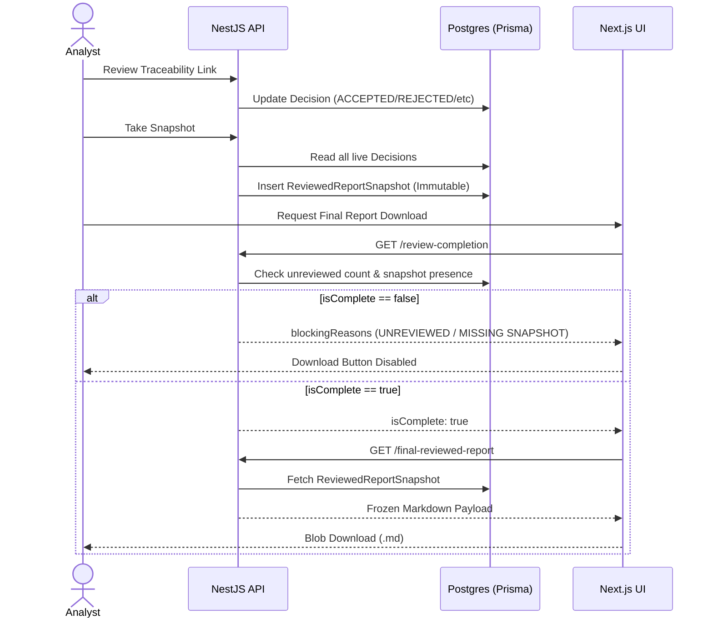

# Audit Workflow & Invariants

This document outlines the invariants, lifecycle policies, and trust model for the Audited Report Workflow. This system guarantees that final exports are 100% human-verified and mathematically immutable after the final audit gate is passed.

## Core Invariants and Trust Model

The overarching reliability story of this architecture is built on absolute immutability and enforced human review. The system does not blindly trust machine output. Instead, it forces human review, captures that review context in a frozen mathematical snapshot, and uses that strict snapshot as the sole basis for final artifact generation.

### 1. Source-of-Truth Matrix

| Stage | Source of Truth | Mutable? |
| :--- | :--- | :--- |
| **Draft approved report** | `GeneratedDocument` | **Yes** / can become stale |
| **Reviewed snapshot** | `ReviewedReportSnapshot` | **No** (mathematically immutable) |
| **Final reviewed report API** | `ReviewedReportSnapshot` | **No** (derived from snapshot only) |
| **Downloaded .md** | Final reviewed report API | **No** local mutation by system |

### 2. Non-Goals / Boundaries

The final export pipeline is deliberately walled off from volatile processes:
- **No LLM during final export:** The final generation process must not call any generative AI models.
- **No retrieval during final export:** The system must not run vector searches or hit raw repository snapshots.
- **No live report rebuild during final export:** The system must not rebuild the report from live state (which could be stale or altered).
- **No mutation when viewing/downloading:** Viewing or exporting a final report are strictly side-effect-free, read-only operations.

## Lifecycle Details

### Review Decision Lifecycle
Analysts review individual `TraceabilityLink` and `Evidence` records. Every link is required to have a decision attached before it is considered "complete".

The complete set of valid decisions:
1. `ACCEPTED` — The evidence is valid and correctly linked.
2. `REJECTED` — The evidence is incorrect or unrelated to the impact.
3. `NEEDS_REVIEW` — Default state; the human has not yet verified the impact.
4. `NEEDS_MORE_EVIDENCE` — The impact is correct, but the currently extracted evidence is insufficient or missing.

### Reviewed Snapshot Immutability
When an analyst initiates the "Take Snapshot" action, the system records the exact `reviewCompletion` metrics, the live analysis context, and the human decisions at that exact millisecond. 
This produces a `ReviewedReportSnapshot` entity. This entity is **append-only and fully immutable**. Any subsequent changes made by an analyst (such as changing an `ACCEPTED` to a `REJECTED`) will mutate the live `TraceabilityLink`, but will **never** alter the previously taken `ReviewedReportSnapshot`.

### Review Completion Gate
The Final Reviewed Report workflow is protected by a strict audit gate (`ReviewCompletionGate`). This gate must evaluate to `isComplete === true` before any human is allowed to view or export the final report.

The gate evaluates two primary assertions:
1. All traceability links have been resolved (i.e. `unreviewed === 0`).
2. A valid, matching `ReviewedReportSnapshot` exists for the current analysis.

### Final Reviewed Report Source-of-Truth Rule
When generating the final markdown, the system **bypasses all live `GeneratedDocument` data**. Instead, it looks exclusively at the mathematical state captured inside the `ReviewedReportSnapshot`. This guarantees that what the human downloaded on Friday matches exactly what they reviewed on Thursday, even if the underlying `ScanJob` was rerun on Saturday.

### Export/Download Rule
The exported markdown file (`final-reviewed-report-{analysisId}-{snapshotId}.md`) is deterministic. It is constructed entirely from the frozen snapshot context and directly served as a raw Blob. The frontend component acts merely as a gateway, fetching the JSON payload and generating the `.md` file download trigger without any interim mutations or state derivations.

## Failure Modes

The `ReviewCompletionGate` enforces strict failure conditions, surfacing clear `blockingReasons`:

- **Unreviewed Links (`UNREVIEWED_TRACEABILITY_LINKS`):** The analyst has not assigned a valid decision (`ACCEPTED`, `REJECTED`, or `NEEDS_MORE_EVIDENCE`) to every active `TraceabilityLink`.
- **Missing Snapshot (`REVIEWED_SNAPSHOT_MISSING`):** The analyst has completed the review but has not executed the explicit "Take Snapshot" action.
- **Post-Snapshot Decision Drift:** If an analyst alters a decision *after* taking a snapshot, the live state diverges from the frozen state. The backend tests enforce that the snapshot and final report *do not drift* and remain permanently locked to the historical record.

## Architecture and Sequence Flow

## Invariant Test Coverage

This absolute immutability is proven by comprehensive test suites:

- **E17A Backend Tests (`final-reviewed-report.audit-flow.e2e-spec.ts`):** 
  - Asserts that missing snapshots and unreviewed links block the gate.
  - Asserts that post-snapshot modifications to decisions do not affect the exported report.
  - Asserts that final reports are derived purely from snapshot payloads.
  
- **E17B Frontend Tests (`final-review-gate-panel.test.tsx` / `final-reviewed-report-viewer.test.tsx`):**
  - Asserts that incomplete gate states visually disable export functionality.
  - Asserts that complete states correctly dispatch the frozen markdown Blob to the user without frontend manipulation.
