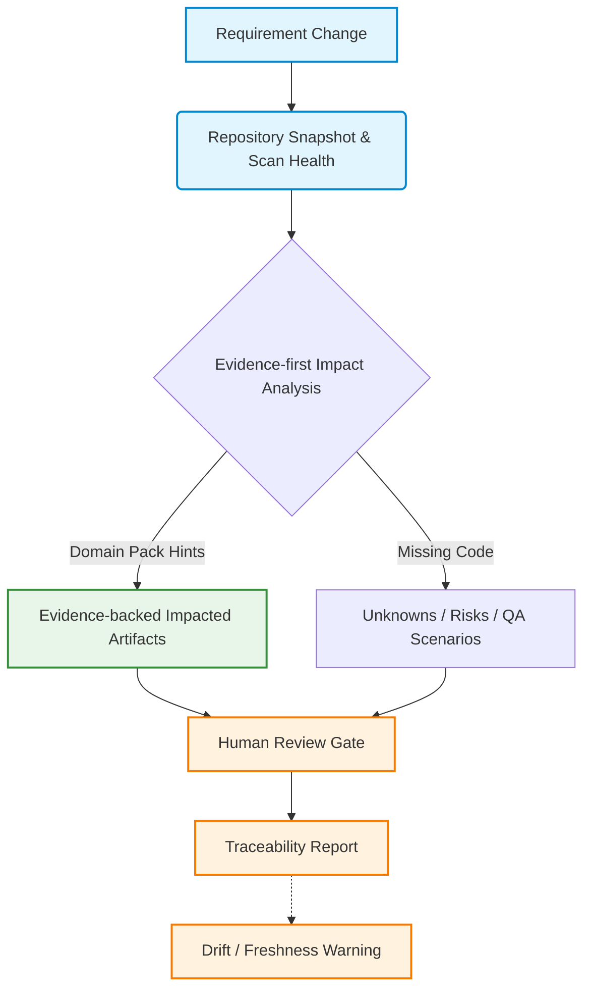
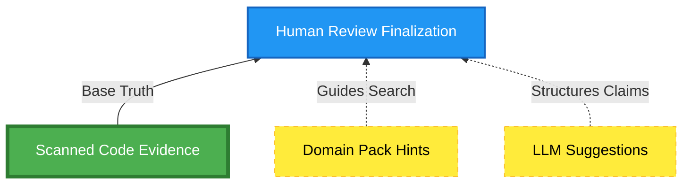
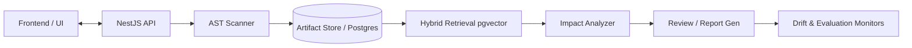
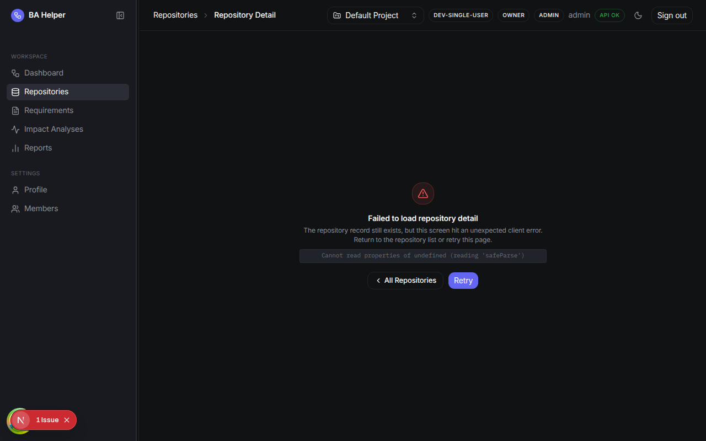
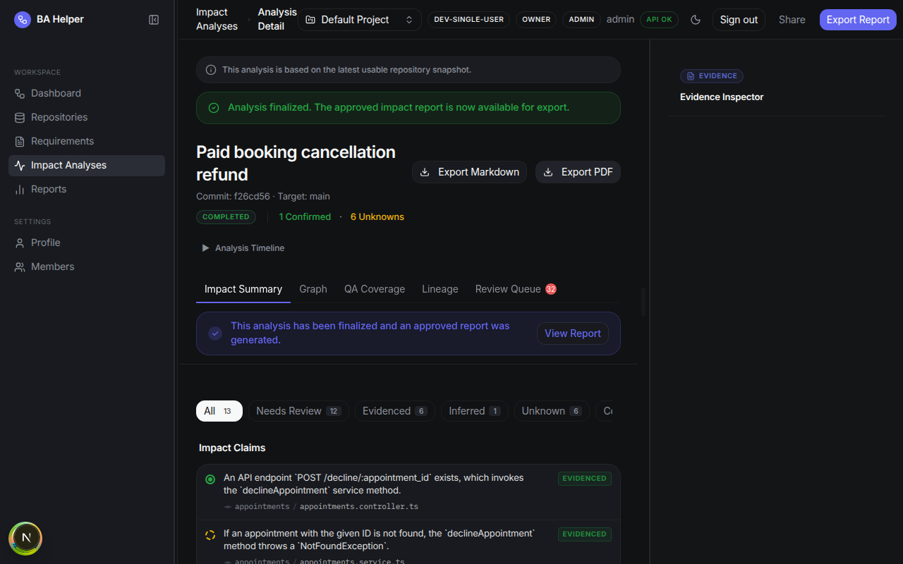
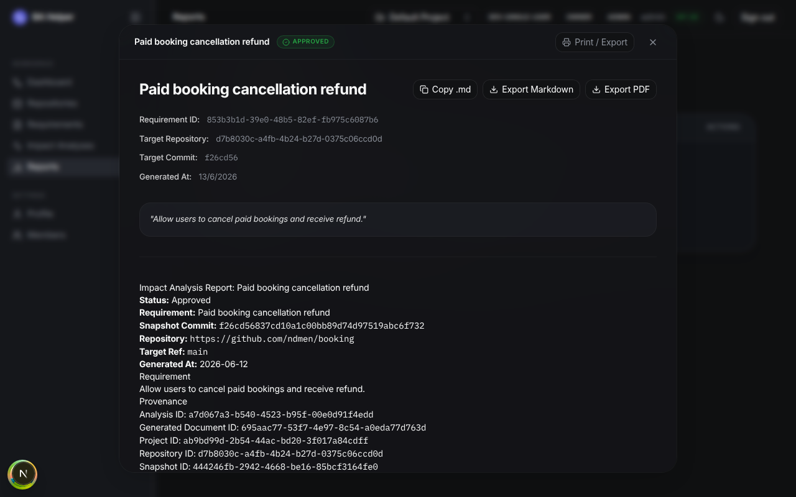

# Visual Demo Proof Pack

This document contains text-based and Mermaid visual artifacts to help reviewers understand the Requirement-to-Code Impact Analyzer in under 60 seconds without relying on external image hosting.

## 1. Golden Path Flow

## 2. Trust Model & Evidence Hierarchy

*Note: EVIDENCED impacts require Scanned Code Evidence. Domain Packs and LLM Suggestions cannot fabricate evidence.*

## 3. System Architecture Diagram

## 4. Screenshot Capture Checklist

The following visual assets demonstrate the finalized UI flows and capabilities:

- **README / project overview**: High-level dashboard showing scanned repos.
  *(See Demo Repositories screenshot below)*

- **golden path test output**: Terminal screenshot showing `pnpm demo:golden-path` passing locally.
  *(Terminal proof managed separately)*

- **scan health panel**: Component displaying `READY` vs `PARTIAL` extraction constraints and scanner maturity.
  

- **impact analysis screen**: UI showing requirement mapped to code artifacts.
  

- **evidence appendix/report**: Detailed view of specific code lines cited by the LLM.
  

- **unknown/risk diagnostics**: View showing unknown components properly isolated.
  

- **human review panel**: Reviewer gate for confirming/rejecting insights.
  

- **traceability report preview**: Approved markdown report.
  

- **drift warning**: UI alert showing `STALE_ARTIFACTS` when a commit is pushed during review.
  *(Captured via separate test fixture)*

- **domain pack evaluation summary**: Terminal or UI showing precision/recall internal quality metrics.
  *(Terminal proof managed separately)*
