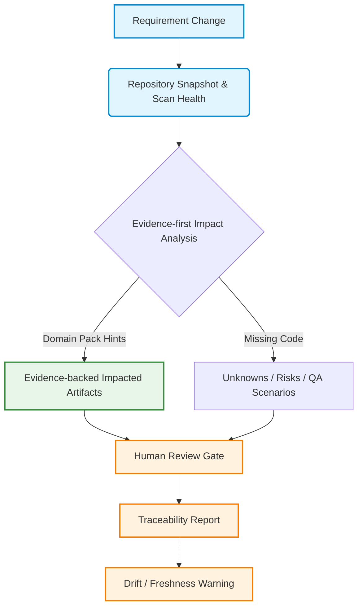
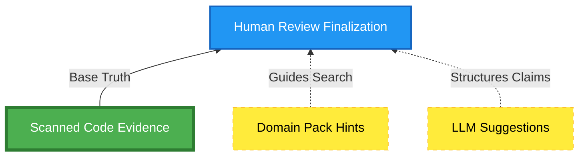
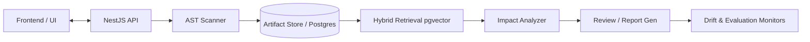

# Visual Demo Proof Pack

This document contains text-based and Mermaid visual artifacts to help reviewers understand the Requirement-to-Code Impact Analyzer in under 60 seconds without relying on external image hosting.

## 1. Golden Path Flow

## 2. Trust Model & Evidence Hierarchy

*Note: EVIDENCED impacts require Scanned Code Evidence. Domain Packs and LLM Suggestions cannot fabricate evidence.*

## 3. System Architecture Diagram

## 4. Screenshot Capture Checklist

The following visual assets should be captured when the UI is finalized. **(Currently TODO Placeholders)**

- [ ] `README / project overview`: High-level dashboard showing scanned repos.
- [ ] `golden path test output`: Terminal screenshot showing `pnpm demo:golden-path` passing locally.
- [ ] `impact analysis screen`: UI showing requirement mapped to code artifacts.
- [ ] `evidence appendix/report`: Detailed view of specific code lines cited by the LLM.
- [ ] `drift warning`: UI alert showing `STALE_ARTIFACTS` when a commit is pushed during review.
- [ ] `scan health panel`: Component displaying `READY` vs `PARTIAL` extraction constraints and scanner maturity.
- [ ] `domain pack evaluation summary`: Terminal or UI showing precision/recall internal quality metrics.
